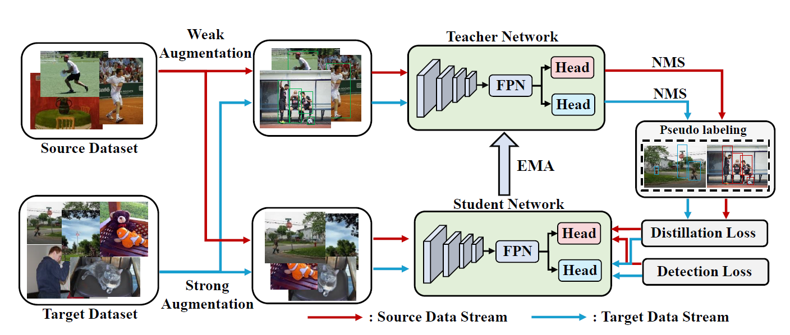

# Domain Incremental Learning for Object Detection


This is the PyTorch implementation of our paper: <br>
**Domain Incremental Learning for Object Detection**<br>

<p align="center">

</p>

# Installation

## Prerequisites

- Linux or macOS with Python ≥ 3.6
- PyTorch ≥ 1.5 and torchvision that matches the PyTorch installation.

## Install PyTorch in Conda env

```shell
# create conda env
conda create -n detectron2 python=3.6
# activate the enviorment
conda activate detectron2
# install PyTorch >=1.5 with GPU
conda install pytorch torchvision -c pytorch
```

## Build Detectron2 from Source

Follow the [INSTALL.md](https://github.com/facebookresearch/detectron2/blob/master/INSTALL.md) to install Detectron2.

## Dataset download

1. Download [COCO12](https://pan.baidu.com/s/1bfhp4W0HAxw1kfBx03jE-w?pwd=cgcs), [Exdark](https://pan.baidu.com/s/14s_2ZcS9ccc06JhH5DrlYw?pwd=k6zc), [BDD100k](https://pan.baidu.com/s/1VAyIxw2a9MMeNQIEG2AXRw?pwd=we8k) and [CityScapes](https://pan.baidu.com/s/1iLVt_qOuF4LuNt7YieBiCw?pwd=rn06) dataset. The datasets are all in COCO format.


2. Organize the dataset as following:

```shell
DILLB/
└── datasets/
    └──bdd100k/
        └── images/
            ├── train
            └── val
        └── annotations/
            ├── bdd100k_labels_images_det_coco_train.json
            └── bdd100k_labels_images_det_coco_val.json
    └──Cityscapes_new/
        └── JPEGImages/
            ├── train_s
            └── test_s
        └── Annotations/
            ├── instances_train_s.json
            └── instances_test_s.json
    └── two_stage_datasets/
        └── index9/
            ├── coco12
            └── exdark
```
3. Process the dataset:

```shell
# Process BDD100k and Cityscapes dataset 
/bin/sh scripts/bdd1_city10.sh
# Process COCO12 and Exdark dataset
/bin/sh scripts/coco1_exdark5.sh
```

## Training

1. Source only
- Train standard supervised Faster-RCNN model using all COCO-12class datasets
```shell
python train_net.py  \
 --num-gpus 4 \
 --config configs/source/coco12_sup100_run1.yaml \
 OUTPUT_DIR output/baseline/coco12
```
- Train standard supervised Faster-RCNN model using all BDD100k-8class datasets
```shell
python train_net.py  \
 --num-gpus 4 \
 --config configs/source/bdd_sup100_run1.yaml \
 OUTPUT_DIR output/baseline/bdd
```
- We provide the model_best.pth of standard supervised Faster-RCNN model trained on COCO12 and BDD100k datasets [here](https://pan.baidu.com/s/1hmZ8xBjPPaOQeLasQm85Zg?pwd=lj9p).

2. Baseline

- Finetune with 1% COCO-12class (source) & 5% Exdark (target)
```shell
python train_net.py  \
 --num-gpus 4 \
 --config configs/baseline/finetune/coco12_1_exdark_5.yaml \
 OUTPUT_DIR output/finetune/coco12
```
- Finetune with 1% BDD100k (source) & 10% Cityscapes (target)
```shell
python train_net.py  \
 --num-gpus 4 \
 --config configs/baseline/finetune/bdd_1_city_10.yaml \
 OUTPUT_DIR output/finetune/bdd
```

- Finetune (Frozen backbone) with 1% COCO-12class (source) & 5% Exdark (target)
```shell
python train_net.py  \
 --num-gpus 4 \
 --config configs/baseline/frozen/coco12_1_exdark_5_frozen.yaml \
 OUTPUT_DIR output/frozen/coco12
```
- Finetune (Frozen backbone) with 1% BDD100k (source) & 10% Cityscapes (target)
```shell
python train_net.py  \
 --num-gpus 4 \
 --config configs/baseline/frozen/bdd_1_city_10_frozen.yaml \
 OUTPUT_DIR output/frozen/bdd
```

- Frozen Network with 1% COCO-12class (source) & 5% Exdark (target)
```shell
python tools/extrabranch/make_extrabranch_weight.py \
--input-dir ./output/baseline/coco12/model_best.pth \
--save-dir ./output/baseline/coco12/model_best_without_rpn_roi.pth

python train_net.py  \
 --num-gpus 4 \
 --config configs/baseline/extrabranch/coco_1_exdark_5_extra_branch.yaml \
 OUTPUT_DIR output/extrabranch/coco12
```
- Frozen Network with 1% BDD100k (source) & 10% Cityscapes (target)
```shell
python tools/extrabranch/make_extrabranch_weight.py \
--input-dir ./output/baseline/bdd/model_best.pth \
--save-dir ./output/baseline/bdd/model_best_without_rpn_roi.pth

python train_net.py  \
 --num-gpus 4 \
 --config configs/baseline/extrabranch/bdd_1_city_10_extra_branch.yaml \
 OUTPUT_DIR output/extrabranch/bdd
```

- Distill with 1% COCO-12class (source) & 5% Exdark (target)
```shell
python tools/distill/make_distill_weight.py \
--input-dir ./output/baseline/coco12/model_best.pth \
--save-dir ./output/baseline/coco12/model_best_distill.pth

python train_net.py  \
 --num-gpus 4 \
 --config configs/baseline/distill/coco_1_exdark_5.yaml \
 OUTPUT_DIR output/distill/coco12
```
- Distill with 1% BDD100k (source) & 10% Cityscapes (target)
```shell
python tools/distill/make_distill_weight.py \
--input-dir ./output/baseline/bdd/model_best.pth \
--save-dir ./output/baseline/bdd/model_best_distill.pth

python train_net.py  \
 --num-gpus 4 \
 --config configs/baseline/distill/bdd_1_city_10.yaml \
 OUTPUT_DIR output/distill/bdd
```

- Train with 1% COCO-12class (source) & 5% Exdark (target) using SA-DA-Faster method
```shell
python train_net.py  \
 --num-gpus 4 \
 --config configs/baseline/da/coco_1_exdark_5.yaml \
 OUTPUT_DIR output/da/coco12
```
- Train with 1% BDD100k (source) & 10% Cityscapes (target) using SA-DA-Faster method
```shell
python train_net.py  \
 --num-gpus 4 \
 --config configs/baseline/da/bdd_1_cityscapes_10_da.yaml \
 OUTPUT_DIR output/da/bdd
```

3. DILLB(Ours)

- Train the DILLB 1% COCO-12class (source) & 5% Exdark (target)

```shell
python model_to_mutihead.py \
--input-dir ./output/baseline/coco12/model_best.pth \
--save-dir ./output/baseline/coco12/model_best_mutihead.pth

python train_net.py  \
 --num-gpus 8 \
 --config configs/dillb/coco1_exdark5.yaml \
 OUTPUT_DIR output/dillb/coco1_exdark5
```

- Train the DILLB 1% BDD100k (source) & 10% Cityscapes (target)

```shell
python model_to_mutihead.py \
--input-dir ./output/baseline/bdd/model_best.pth \
--save-dir ./output/baseline/bdd/model_best_mutihead.pth

python train_net.py  \
 --num-gpus 8 \
 --config configs/dillb/bdd1_city10.yaml \
 OUTPUT_DIR output/dillb/bdd1_city10
```
